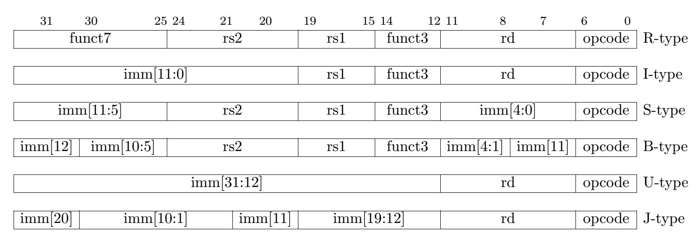
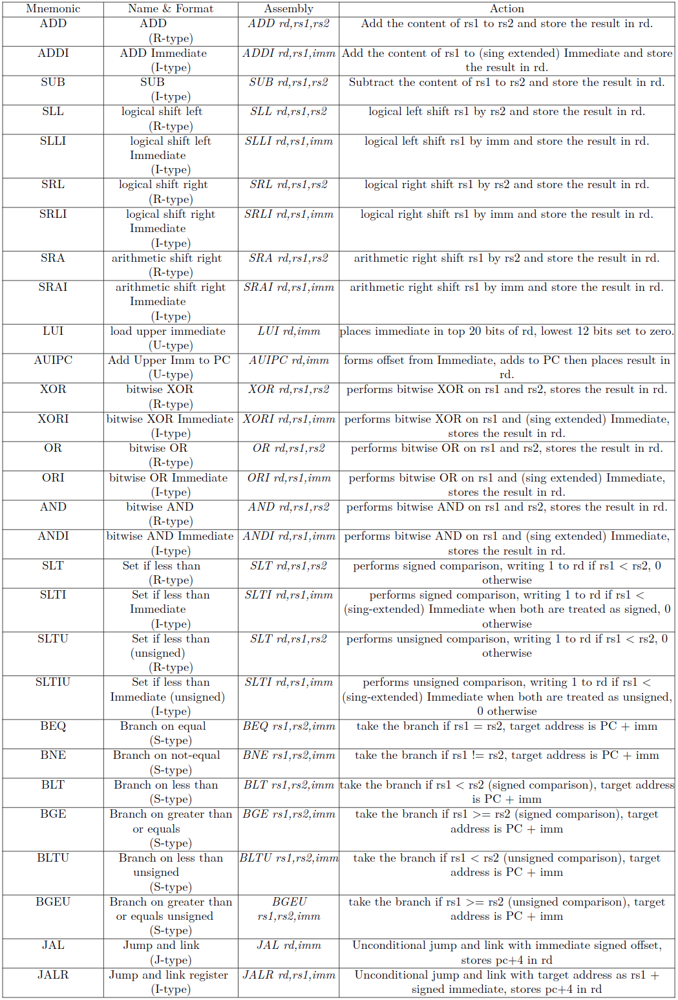

## Instruction formats

## Instruction Set

## Scripts
#### ` iitb-risc-simulator.php ` 
- It implements the programmer's model of RISC-V Base Integer ISA. Program is read in the form of assembly code. 

- After every instruction, values of updated state elements (registers and memory locations) is echoed.
    
- The number of instructions to be executed is to be given as a command line argument, along with path to program file.
   
      php iitb-risc-simulator.php 4 <path-to-program.txt>

#### ` getprogram.py ` 
- This is the assembler that converts assembly code to machine readable bit stream that can be used to initialise the instruction ROM.
- takes assembly code file as input:
      
      python getprogram.py <path-to-program.txt>

**Note**: Both simulator and assembler assume correctness of syntax of assembly code provided.

## References
1. https://riscv.org/wp-content/uploads/2017/05/riscv-spec-v2.2.pdf
2. https://inst.eecs.berkeley.edu/~cs61c/fa17/img/riscvcard.pdf